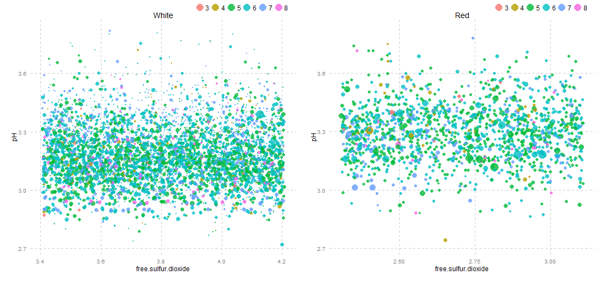
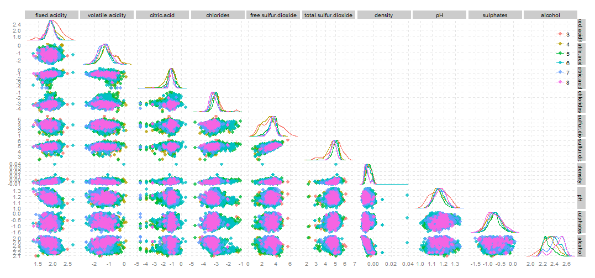
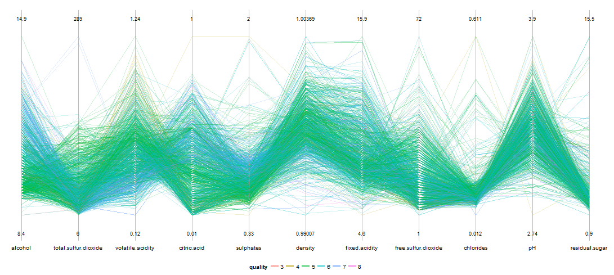
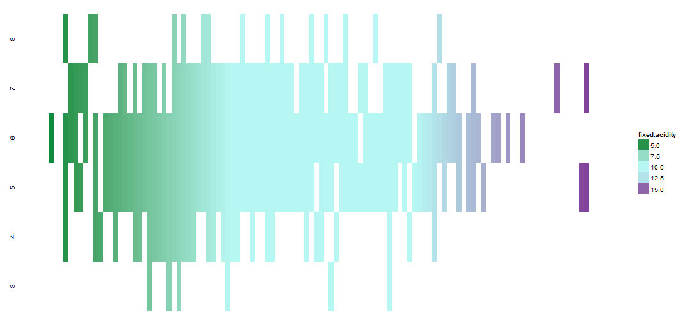

Final Project
==============================

| **Name**  | Prateek Singhal  |
|----------:|:-------------|
| **Email** | psinghal@dons.usfca.edu |

## Instructions ##

The following packages must be installed prior to running this code:

- `ggplot2`
- `GGally`
- `scales`
- `reshape2`
- `gridExtra`
- `shiny`
- `plyr`
- `data.table`
- `RColorBrewer`
- `grid`

## Introduction ##

Using 4 different types of visualizations, I am trying to distinguish between white and red wine with respect to their chemical contents and trying to understand what makes them different. The description about the wine can be found [here](http://en.wikipedia.org/wiki/Vinho_Verde).
The four visualizations are:
1. Bubble plot
2. Scatter plot matrix
3. Parallel co-ordinates plot
4. Heat map

## Bubble Plot ##
During the development of this visualization, I wanted to present flexibility to the user which is why this plot provides some level of freedom to the user to select the variables for the X, Y axes and also for the size of the bubble. 

The variables on the X axis are placed on a logarithmic scale by default because of high cluttering of the data. In other words, data density was really high due to the presence of too many data points. Log scale helped in spreading the data apart and made for a nicer and more interpretable visualization. 

There is some amount of jitter in the plot which introduces lie factor but prevents overlapping of data points. The data-ink ratio for this visualization is pretty low as most unwanted attributes like tick marks, minor grid lines, gray background etc have been removed. The major grid line's color has also been changed to light grey so that it doesn't attract a lot of viewer's attention. The legend has also been placed on top of the plot so that it doesn't accidentally overlap any of the data point in the visualization. 

This type of plot is pretty effective in showing outliers in the dataset. Outliers in this case could be extreme values with respect to X and Y axes or extreme values with respect to the bubble size. For example - one can see a few outliers when the selected variable for bubble size is 'Chlorides'. One can also try to look for clusters available within the data by looking at different wine qualities, represented by various colors. Though clusters are not very clearly visible in this case, this plot is capable of showing clusters in the data if they are present within the data. 

Depending on the choices made for X, Y axes variables and the variable for bubble size, one can learn different things about the underlying data. Because of this choice, the interpretation from this visualization is completely dependent on the viewer. Each combination of these variables can lead to a different interpretation of clusters or outliers. 

## Scatter plot matrix ##

A scatter-plot matrix is capable of showing a lot of data on small individual plots at the same time. It provides us a good overall picture of the data. 

Because of the presence of a lot of data on this visualization, it is hard to pin down any kind of trends but it is possible to look at outliers in the data. The diagonals of this visualization also show us the distribution of the variables in question. It can be clearly seen that there are some long tails in the data pointing to a few outliers present in the data. We can also notice that the distribution of 'sulphates', 'pH' etc is almost normal for most wine quality types whereas distribution of 'alcohol' is often bi-modal and skewed depending on specific wine quality types. One can try to look at clusters by filtering the data using the check boxes (explained more in the interactivity section). 

The data density for this visualization is pretty high as there are multiple small plots. The presence of jitter introduces some lie factor. I have tried to keep the data-ink ratio optimal by removing ticks, background, minor grid lines etc. 

The values on the X axis are slightly hard to see. I could have made the height of the plot bigger but it would have meant using a scroll bar in order to visualize the whole plot. Therefore I shied away from doing so and did my best to fill the screen place with the biggest possible plot. The X axis has also been converted to a logarithmic scale in order to prevent too much cluttering (which is happening anyway because the size of the individual plots forming the whole visualization are so small, cluttering would have been worse without the log scale). 

The axes labels are cut abruptly on the right hand side of the plot. Increasing the height of the plot would have solved this problem as well but because these labels are displayed clearly on top of the plot, it's not much of a problem as the viewer can easily relate to the names of these variables (by referring to the labels on top). 

## Parallel co-ordinates plot ##

This type of plot is very useful in visualizing clusters, outliers and the overall spread of the data with respect to individual variables. 

It can be clearly seen from the visualization that the number of observations for certain wine quality types are few where as they are much more for some of the others. One can also see clearly that variables like 'density', 'free sulphur dioxide' and 'residual sugar' are limited in their ranges where as variables like 'alcohol', 'pH' and 'sulphates' are well spread out. It is also very easy to look at what are some of the outliers in the data and what wine quality type does it belong to. We can notice a major outlier which has an extremely high value of density, another outlier has a high residual sugar value etc. 

One can also make use of the filtering that I have implemented (explained in the interactivity section) to look at different wine quality types to make inferences about them. This plot also works very well as it shows the minimum and maximum values for each of the variables present in the dataset which gives a fair idea about the range of variables to the viewer. 

The lie factor for this plot is minimal as there is no jitter, the data is being displayed as is. The data-ink ratio is optimal as well because nothing unwanted is being displayed on the plot. Data density on the other hand is slightly high because of the number of data points displayed but one can filter on the wine quality type which will reduce the data density to an extent. 

## Heat Map ##

This plot is extremely useful in comparing various wine quality types against each other. It shows the viewer an overall spread/range of the values associated with a variable across all wine quality types. 

Depending on the X axis variable chosen from the UI, one can easily distinguish between the spreads of values across different wine quality types. This visualization is also good at pin pointing outliers in the data. For example, when the X axis variable is 'chlorides' and the wine type is 'red', we can clearly see an outlier which has a very high chloride value and belongs to quality type 4. One can also notice that the spread in quality type 8 is not a lot. Once the X axis variable is changed to 'residual sugar', it is easy to see a few outliers (long tails) for wine quality type 6. The interactivity enables the viewer to draw their own inferences for different variables.

The color scheme used for this visualization is diverging as it presents a nice contrast between high and low values to the user. I have chosen light blue color for the intermediate values which nicely distinguishes between green (for low values) and purple (for high values) and is very easy on the eyes. 

This visualization preserves a good data-ink ratio as nothing unwanted is being displayed. Data density and lie factor for this plot can be argued about slightly. This plot does not do a very good job at giving the user an idea about how many cases are being displayed which introduces some lie factor. For example - a wine quality type with a very narrow range may be displaying many cases at the same time without the viewer even realising the number of cases being displayed. 

## Interactivity ##

The dataset contains values for two different wine types - white and red. I have included a drop down which may be used to visualize white wine v/s red wine at any point for any of the visualizations. There is also an option to visualize both wine types at the same time and it works only for the bubble plot. When this option is selected, bubble plots for both, white and red wine are shown next to each other where comparisons can be done and inferences can be made. I have not implemented this functionality for the rest of the plots as the visualizations become too cluttered and hard to look at when viewed together. 

There is flexibility for the user to select variables that they want to visualize on the X and Y axes. These drop down work for the bubble plot. The drop down for X axis variable also works for the 'Heat Map'. 'Scatter plot matrix' and 'Parallel co-ordinates plot' are showing all the variables at the same time which is why they don't need this functionality. The user also has the flexibility to choose the variable for for bubble size and this works only for the bubble plot. 

I have also included check boxes for various wine quality types which the user may want to visualize separately for purposes of comparison. This functionality works very well across bubble plot, scatter plot matrix and parallel co-ordinates plot. Parallel co-ordinates plot wants at least two wine quality types to be selected as it does not work with only one group by default. When none of the check boxes is selected, all wine quality types are displayed by default. This technique has not been applied to the heat map because all wine quality types are already shown on a single plots in different rows, so each type is completely separate already. Filtering may be useful when the viewer feels that there are too many data points to look at or when they want to compare specific types at the same time (say 4 and 7).

I am trying to display about 5000 cases for white wine and close to 1800 cases for red wine. This can lead to dense plots which is why the use of 'alpha' is inevitable. I wanted to provide enough flexibility to the user to be able to change alpha as per their comfort. Some people may like higher values of alpha while other may not. This is the primary reason I still have this functionality in my visualization despite criticism and people suggesting me to take this functionality out during prototype presentations. For example - if a user wants to compare only two wine quality types on the bubble plot, they may use higher values of alpha whereas if they want to visualize many types at the same type, lower alpha value may be preferred. 

## Prototype Feedback ##

In the prototype exercise, I had started by displaying only a single plot which was the bubble plot. I still had some interactivity in place based on which I received some valuable feedback. The plot that I had displayed was certainly 'vanilla' and did not look the best at the time. 

One of the best feedback points that I received was to put my data on a logarithmic scale in order to avoid cluttering of the data which is much harder to visualize. When I showed the bubble plot for both, white and red wines at the same time, the Y axis did not match for both plots. I made the change and now the axes align properly. 

I was also asked during the exercise to remove the slider for changing the alpha value which I did not completely agree with. I wanted this slider to be there because different viewers have different preferences. Some user may prefer higher alpha values over lower values and vice versa. This is why I still have the alpha slider in place. 

## Challenges ##

Dealing with many data points was a slight problem to begin with as many data points tend to make the visualizations dense and not very easy to look at. I was initially planning to display data points for white and red wine on the same plot but I decided against it. This meant having a drop down list for the choice of wine to be displayed for the user. I had to include a few if-else conditions in my R code in order to accomplish this properly. The functions became slightly harder to manage but the visualizations made more sense and were less dense. 

Another challenge that I had faced was the rendering time of scatter plot matrix and parallel co-ordinates plot on the screen. These plots are showing a lot of data on screen and are thus, slow to display on screen. I am still trying to figure out ways to make this faster but I haven't come across anything apart from displaying fewer data points. 

Given more time, I would re-implement everything in D3. I have wanted to learn D3 for a while but switching to something completely new would have been a risky bet, so I just ended up playing safe. 

I would also implement some clustering and predictive algorithms if I had more time. It would have been interesting to look at data points which really belong to the same clusters versus the points which overlap. 