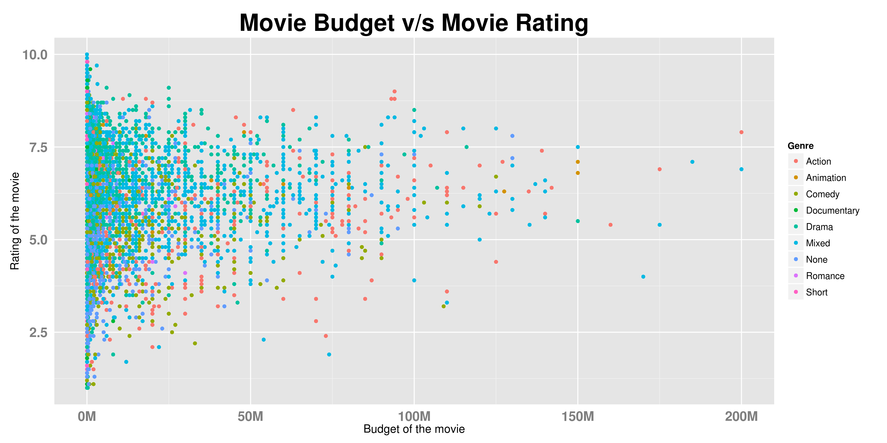
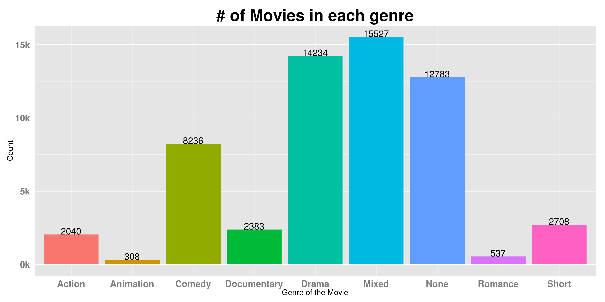
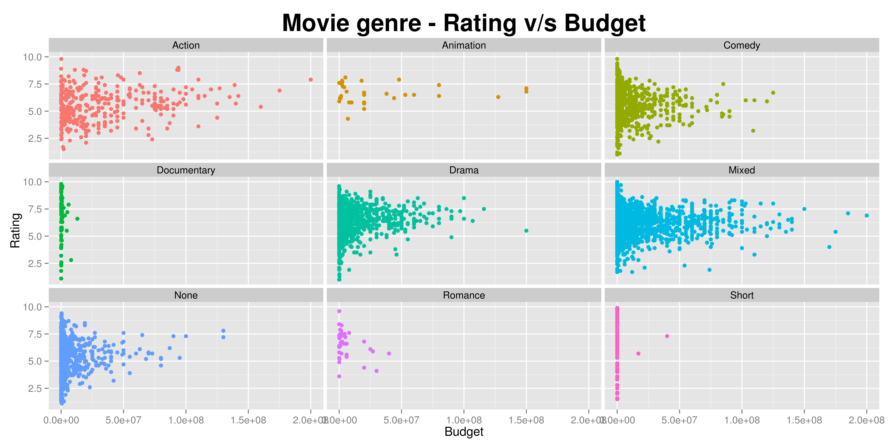
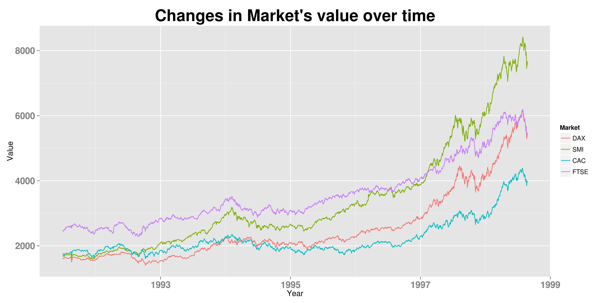

Homework 1: Basic Charts
==============================

| **Name**  | Prateek Singhal  |
|----------:|:-------------|
| **Email** | psinghal@dons.usfca.edu |

## Instructions ##

The following packages must be installed prior to running this code:
- `ggplot2`
- `reshape2`
- `scales`

To run this code, please enter the following commands in R:

```
library(devtools)
source_url("https://github.com/patthebug/msan622/blob/master/homework1/HW-1.R")
```

## Discussion ##

Answer 1:

The following plot displays ratings of movies against the budget of movies. Various colors on the plot show the different genres of the movies. The X axis has been formatted to display budget in Millions of dollars and Y axis displays rating of the movie as per IMDB. The size of the text on the axes and the size of the title has also been changed. 



Answer 2:

The following plot displays the number of movies present in each genre. The text on the axes and the title of the plot have been modified to make then look bigger. The ticks on X and Y axes have also been removed. The legend has been removed as it was not contributed to anything. The Y axis has been modified to display the number in thousand. Numbers have been placed on top of each bar to provide a better explanation of relative sizes.



Answer 3:

The following plot shows a small-multiples scatter plot of each genre separately. Y axis has been changed to display budget of the movie in Million dollars and X axis represents the rating of the movie. The size of the title has been changed to make it bigger. Legend has also been removed as it did not contribute to any additional information. The ticks from X and Y axes have also been removed.



Answer 4:

The following plot shows the changes in values of various markets over time. The text on the legend has been modified. The labels on X and Y axes and the title have also been modified to make them bold. The ticks have been removed from the X and Y axes. 

