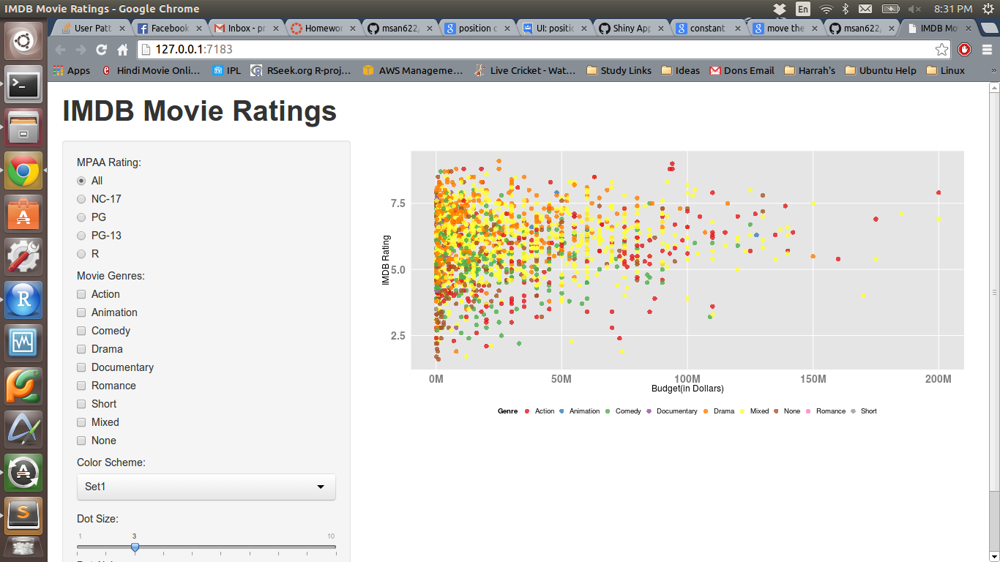

Homework 2: Interactivity
==============================

| **Name**  | Prateek Singhal  |
|----------:|:-------------|
| **Email** | psinghal@dons.usfca.edu |

## Instructions ##

The following packages must be installed prior to running this code:

- `ggplot2`
- `shiny`

To run this code, please enter the following commands in R:

```
library(shiny)
library(ggplot2)
library(scales)
shiny::runGitHub('msan622', 'patthebug', 'homework2')
source_url("https://github.com/patthebug/msan622/blob/master/homework1/HW-1.R")
```

This will start the `shiny` app. See below for details on how to interact with the visualization.

## Discussion ##

The following plot displays IMDB ratings of various movies versus their budget in Million Dollars. The plot also provides interactivity and enables the user to do the following things:
```
1. Select the MPAA rating ('All' is selected by default)
2. Select various movie genres (the HW does not ask us to create check boxes for the 'Mixed' and 'None' genre. They have been created nonetheless so that the viewer has more choices)
3. Select the color scheme for the plot ('Set1' is selected by default)
4. Change the dot size using the slider control
5. Change the alpha using slider control
```

The plot itself shows various movie genres in various colors depending on the selected color scheme. The X axis has been modified to display the budget in Million Dollars. The X axis label is 'Budget(in Dollars)', it could have also been modified to display figures like $50M etc. It achieves the same effect without cluttering the axis labels. The ticks from X and Y axes have been removed so that the viewer is not distracted from the plot. 
Minor grid lines have been removed from both the X and Y axes as they were not helping in this case. 
All the genres are shown on the plot when none of the genres has been selected as an empty plot would not make any sense (i.e. when no genre is selected). 
The grey background displayed in the legend has been removed as it was not contributing anything to the visualization. The legend has been moved to the bottom so that it takes less space. Jitter has also been introduced so that dots do not overlap each other.

