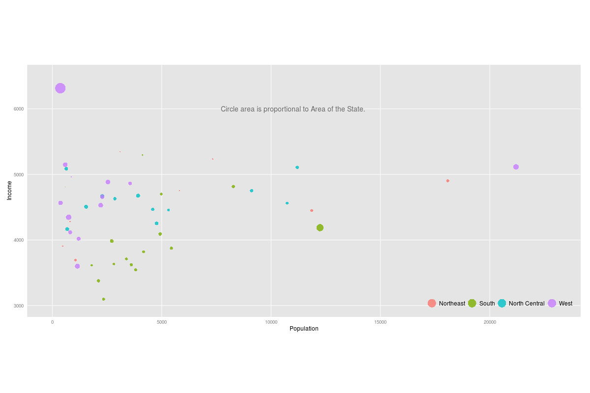
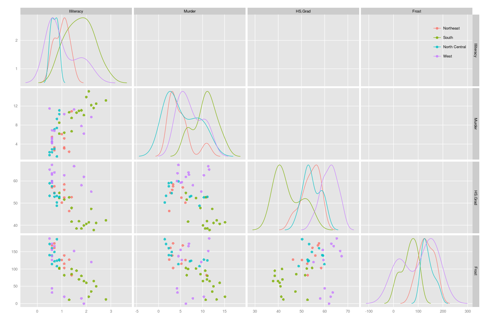
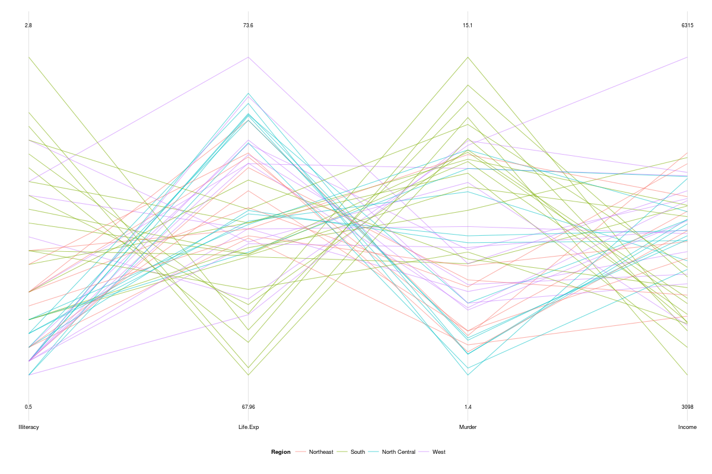

Homework 3: Multivariate
==============================

| **Name**  | Prateek Singhal         |
|----------:|:------------------------|
| **Email** | psinghal@dons.usfca.edu |

## Instructions ##

The following packages must be installed prior to running this code:

- `ggplot2`
- `shiny`
- `GGally`
- `scales`
- `reshape2`
- `plyr`
- `data.table`

To run this code, please enter the following commands in R:

```
library(shiny)
library(ggplot2)
library(scales)
require(GGally)
library(reshape2)   
library(plyr)       
library(data.table)
shiny::runGitHub('msan622', 'patthebug', subdir='homework3')
source_url("https://github.com/patthebug/msan622/tree/master/homework3")
```

## Discussion ##

The following Shiny app shows the technique 'filtering' applied to the 'State' dataset via 3 different plots:
1. Bubble Plot
2. Scatter Plot Matrix
3. Parallel Co-ordinates Plot

The filtering is consistent across all the plots, eg., if various regions are selected, they are reflected across all the 3 plots. There is also a functionality to change the alpha value to darken or lighten the dots or lines on the plots. User also has the option to choose different color schemes.
Each of the three techniques will now be discussed in detail.

Bubble Plot
This technique was chosen because it does a good job of explaining the variables that I have chosen to visualize. I have chosen population, income, area of the state and region (South, West etc) to visualize in the bubble plot. Different colors on the plot represent the regions whereas the area of the dots (circles) represent the area of the state. The aforementioned variables were chosen to see the relationships between area of the state, region and income of the state wrt population of the state. The variable 'Region' has been used to determine the color of the dots present on the plot. 

I have changed a few things to customize the plot and make it look more pleasing to the eyes.
1. The color scheme in the plot is consistent (i.e. if 'South' is red, it remains red always upon selecting and de-selecting regions)
2. The background of the legend text has been removed and the position of the legend has been changed to place it on the plot itself. This saves some area from being wasted.
3. The ticks from the X and Y axes have been removed to reduce distraction, they were also not adding any additional value to the plot.
4. An annotation has been placed on the plot to display what the circles mean.
5. Minor grid lines have been removed as they were distracting.
6. The limits of the plot have been modified so that the plot doesn't change every time a region is selected.



Looking at the bubble plot, one can make the following observations:
1. Southern states are in general, lower income states. 
2. Northeastern states in general are much smaller than the rest of the states.
3. The state having maximum area also has the highest income.

Scatter Plot Matrix
This technique was chosen as it does a pretty good job of explaining the correlation amongst various variables in question. 
Variables chosen - Illetracy, murder, HS.Grad, Frost and Region. These variables are interesting in looking typically at education versus crime for various regions. 
The data has been encoded using the variable 'Region'. Selecting the same variable region provides consistency across all the plots.

Customizations performed:
1. Removed the minor grid lines as they were distracting
2. Removed the unrequired gray background from the legend
3. Placed the legend on top of the plot to save some space
4. Removed the ticks from axes as they were distracting



The following conclusions can be made by looking at the Scatter Plot Matrix:
1. Southern states apppear to have the highest Illetracy, murders and lowest rate of High School graduates
2. Western states seem to have the highest number of high school graduates and lower number of murders as compared to Southern states
3. North eastern states seem to be colder compared to Western states

Parallel Co-ordinates Plot:
The columns chosen to be visualized in this technique are - Illetracy, Life expectancy, murder, income and region. These columns were chosen basically to look at education level and health status in various regions. The variable 'Region' is used to encode the data i.e. it represents the colors on the plot. Selecting the same variable region provides consistency across all the plots.

Customization performed:
1. Removed the unrequired gray background from the legend
2. Placed the legend at the bottom of the plot to save some space
3. Modified the Y axis to display the minimum and maximum value for each variable in question



The following conclusions can be made by looking at the Parallel co-ordinates plot:
1. Southern states appear to have a lower life expectancy, income and higher illetracy and murders compared to other regions
2. Though there is some variance in Western states, they appear to have higher life expectancy and low illetracy when compared to other regions
3. Northeast and west exhibit similar behavior but some state in the west outshine the others in Northeast