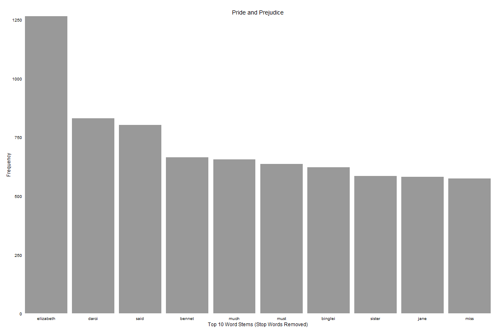
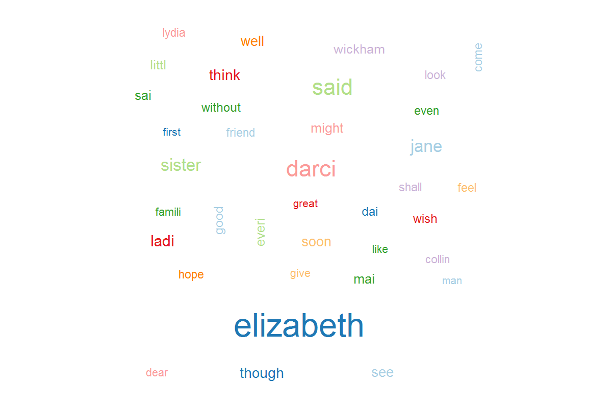

Homework [#]: [HOMEWORK NAME]
==============================

| **Name**  | Prateek Singhal  |
|----------:|:-------------|
| **Email** | psinghal@dons.usfca.edu |

## Instructions ##

```
require(ggplot2)
require(tm)
require(SnowballC)
require(wordcloud)
shiny::runGitHub('msan622', 'patthebug', subdir='homework4')
source_url("https://github.com/patthebug/msan622/tree/master/homework4")
```

## Discussion ##

As part of this assignment, I decided to use the famous book called 'Pride and Prejudice'. This book contains approximately 124,000 words.
The very first visualization is a bar plot. This bar plot displays the frequency of words in the book. One can clearly see that the names appearing in the book are one of the most frequently occurring words. This plot has a lie ratio of zero as it shows simply the frequency of words appearing in the document. The ticks have been removed from the plot thereby reducing the data ink ratio of the plot. Gray color has been used to display the bars which is warm and easy on the eyes.



The next visualization is a word cloud. Though word clouds are not very useful for many things, they do a decent job of giving out a pretty picture and displaying the relative word frequency. It is not as effective as the bar plot in displaying the word frequencies but is still easy on the eyes. Word clouds are usually low on lie factor as the size of each word is scaled to its frequency. The data ink ratio however is high in case of word clouds when compared to bar plots. The following image shows a word cloud for the book in question. 



The next visualization is a word tree. A word tree shows what other words, a specific word is related to. The size of the connecting word is encoded in the size of the word. The lie factor in this case is low as well but the data ink ratio is high as compared to a bar plot as many words are being displayed, not all of them are as important. This visualization works primarily because the user has the capability to interact with the visualization and move the words back and forth to uncover the relationship amongst various words. The following is a static image of a word tree from the dataset in question.


The next visualization is call Phrase Net. This visualization is useful when the user has some intuition about some word separating two words. This visualization displays all the words separated by the given word. The following visualization shows all the words separated by the word 'and'. This visualization also encodes the frequency of occurrence in the size of the word and is therefore low in lie factor but high on data ink ratio as it displays all related words in this case. All these words may not be necessary.

