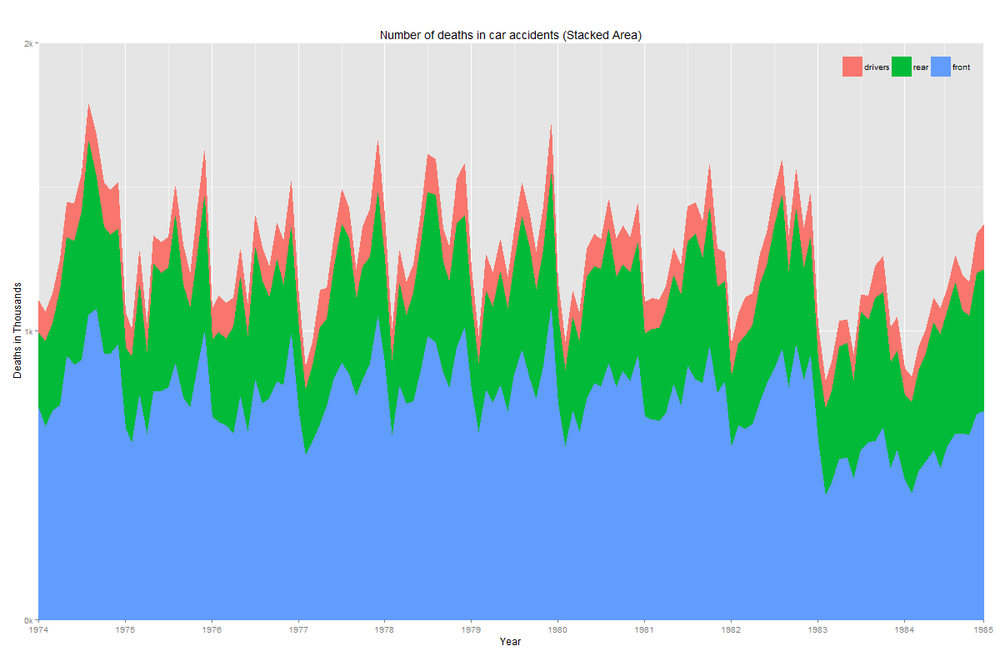
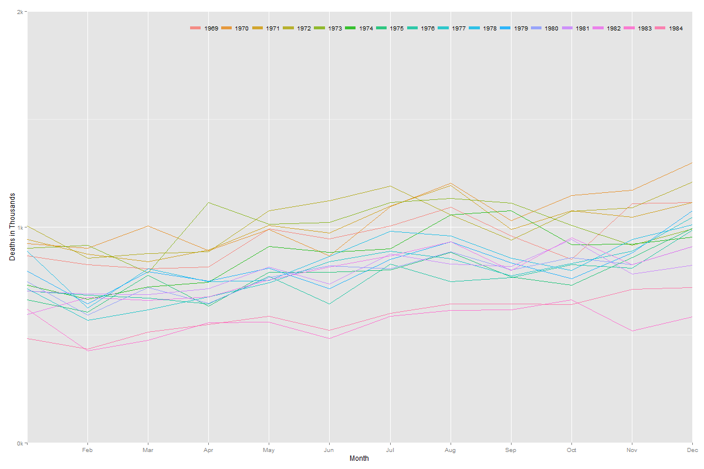
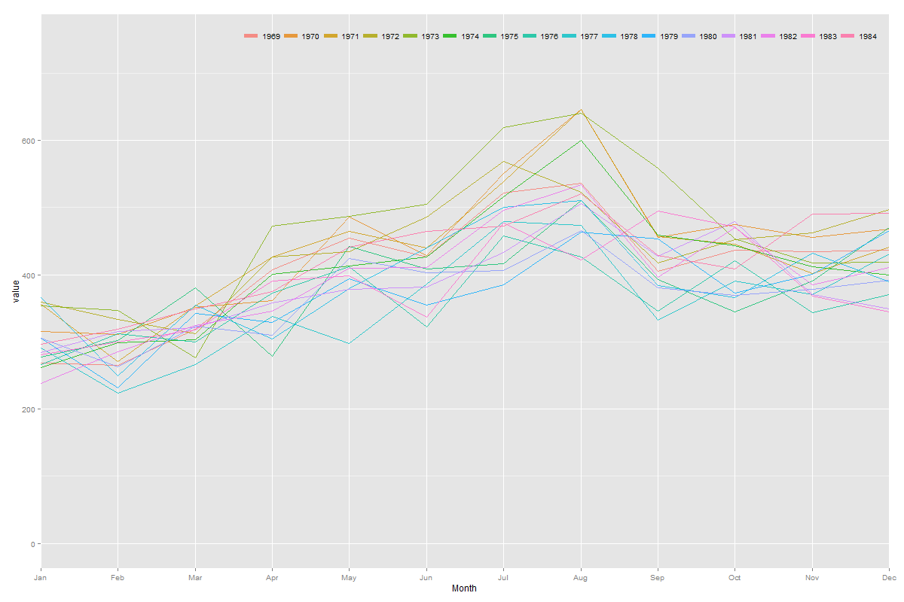
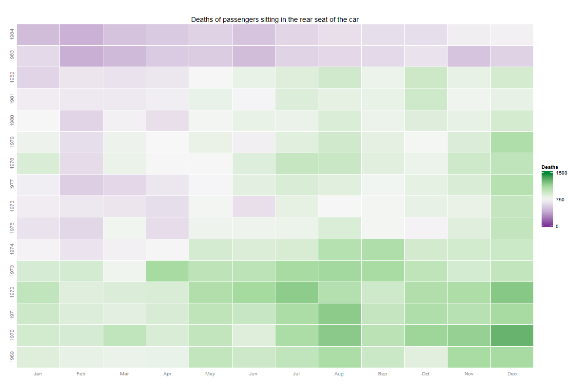
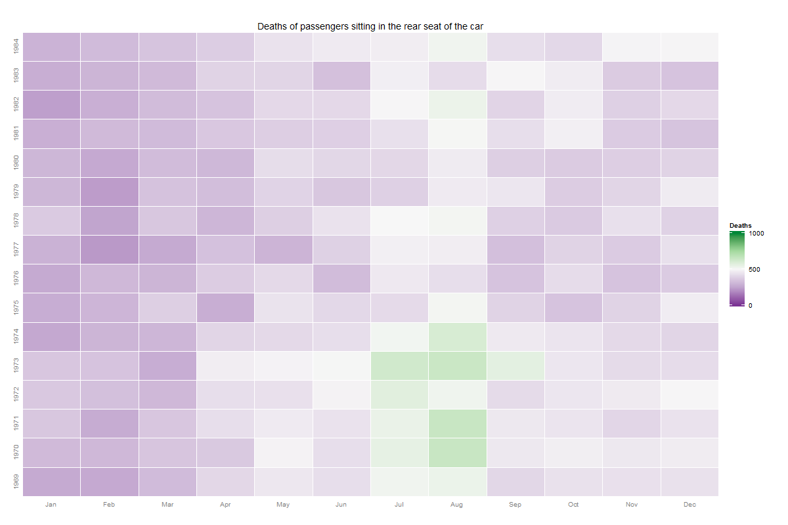
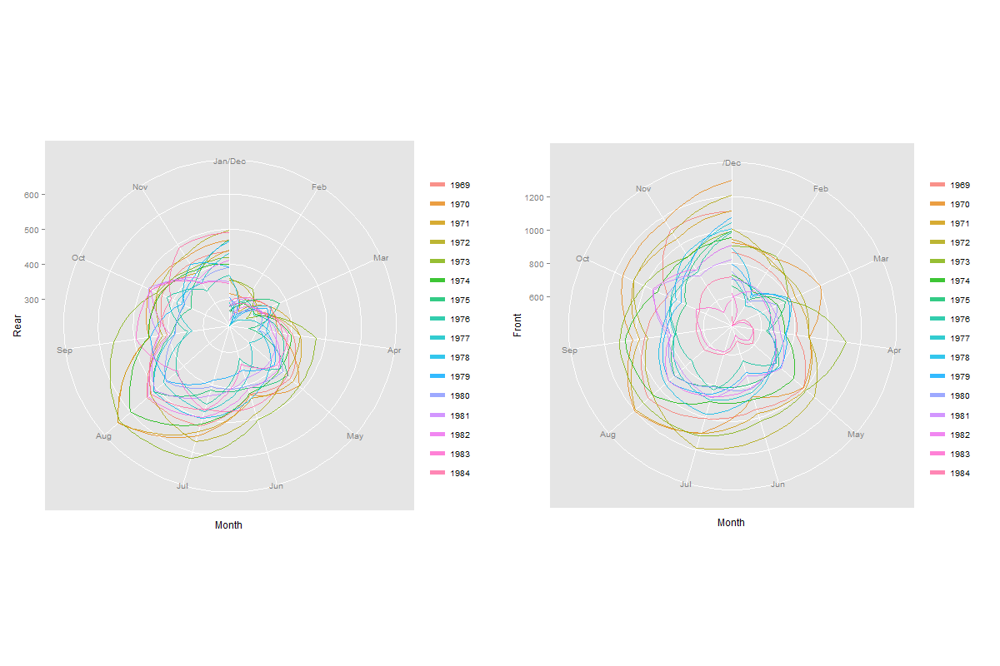
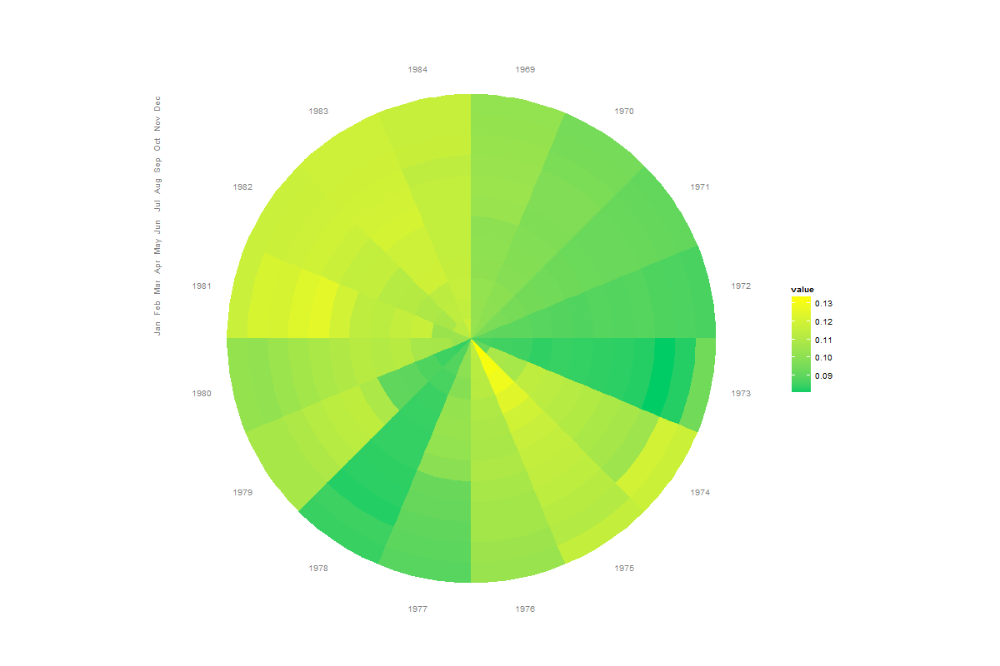

Homework 5: Temporal
==============================

| **Name**  | Prateek Singhal  |
|----------:|:-------------|
| **Email** | psinghal@dons.usfca.edu |

## Instructions ##

The following packages must be installed prior to running this code:

- `ggplot2`
- `GGally`
- `scales`
- `reshape2`
- `gridExtra`

## Discussion ##

The following plot shows a stacked area chart for the number of deaths in the UK from a period of 1972 through 1984. It can clearly be seen from this plot that most people sitting at the front seat are prone to deaths or fatal injuries if the car is involved in an accident. The rear passengers are safer as compared to the front passengers. This dataset does not take into consideration the number of vehicles that were without any rear passengers. Assuming that not all cars would have rear passengers, it is not a surprise that the number of deaths for front passengers is more than the number of deaths for rear passengers. 
It is interesting to see that not a lot of drivers were fatally injured during accidents, perhaps they were aware at the last moment that the accident would occur and therefore took evasive action. 
A stacked area plot in general does a good job at comparing different categories but is not very good at showing the real numbers for each category. 
The plot gets rid of the minor grid lines, places the legend on the plot to not waste space. It also gets rid of the legend title. The plot keeps the ticks in place as they contribute to making the user understand where the years start and end. 
This plot has very low lie factor (close to zero) and high data-ink ratio.

The next plot shows the year-on-year comparison of deaths/fatal injuries suffered by people sitting in the co-driver seat. Though this plot shows a comparison between the number of deaths in different years, it also has a problem of cluttering. If we had data for many more years, this kind of plot may not have been a perfect choice as all the lines would have cluttered. This plot has very low lie factor and a high data-ink ratio. The minor grid lines have been removed as they were not contributing to anything. The legend has been moved on the plot as well.

The next plot is similar to the last plot except that it shows the deaths/fatal injuries of passengers sitting on the rear seat of the cars. It has the same pros and cons as described above. It has a low lie factor and high data-ink ratio.  The minor grid lines have been removed as they were not contributing to anything. The legend has been moved on the plot as well.

The next two plots try to focus on the same elements - number of deaths/fatal injuries to front and rear passengers. This time I have tried to provide a different perspective using a heat map. The plots clearly show that the number of deaths did actually go down after the compulsory seatbelt law was introduced in the beginning of 1983. Both these plots have low lie factor and high data-ink ratio. It is visually more pleasing and more appealing to the eye as compared to line plots which can clutter at times.
A bit of a 'tiling' effect has been added so that the user can differentiate between colors easily without getting them overlapped. 

Deaths/fatal injuries to front seat passengers:

Deaths/fatal injuries to rear seat passengers:

The next plot tries to compare the same variables again on polar coordinate axes. This kind of visualization is helpful in realizing the way patterns emerge during years. I deliberately kept the legends for both the plots in as the user's eyes are used to watching legends at the right by now. For some unknown reason, the word 'Jan' doesn't appear on the axis for the plot on the right hand side. I spent at least an hour fixing this problem for no results. I have no idea how to solve this problem as I am using exactly the same code for both the plots. 
This visualization has a low lie factor and high data-ink ratio.
In general, these two plots were created separately and then merged later.
These plots make for a pretty picture but really are not contributing much more than ,multi-line plots.

Till now we have only looked at deaths, lets look at petrol prices now. The following circular heat map displays petrol prices month by month for the given time frame. This plot does not work very well as far as area of each block is concerned as the area for blocks are not equal. A rectangular heat map would have been better to display this data. This introduces a lie factor to the plot where the user believes that the area of blocks mean something when they actually don't. The data-ink ratio is high. 
The plot shows an obvious pattern that the petrol prices went up by time except in 1978. The overall trend is increasing.

