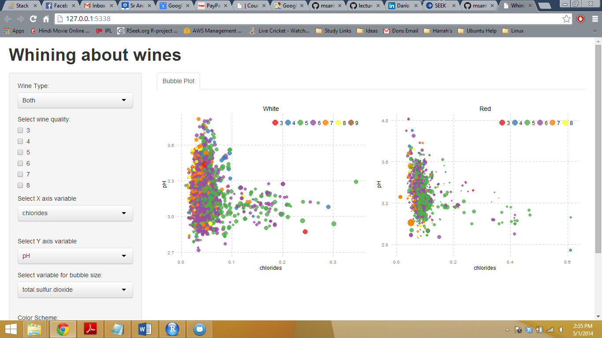

Project: Prototype
==============================

| **Name**  | Prateek Singhal  |
|----------:|:-------------|
| **Email** | psinghal@dons.usfca.edu |

## Discussion ##

The image shows a bubble plot where the user has the flexibility to choose the X axis variable, Y axis variable and the variable for bubble size. The plot will automatically switch between displaying a single plot and displaying a facet grid with 2 plots upon user's selection of wine type from the UI.

The following image shows a static visualization of the app:

The R code is available in the github repository.