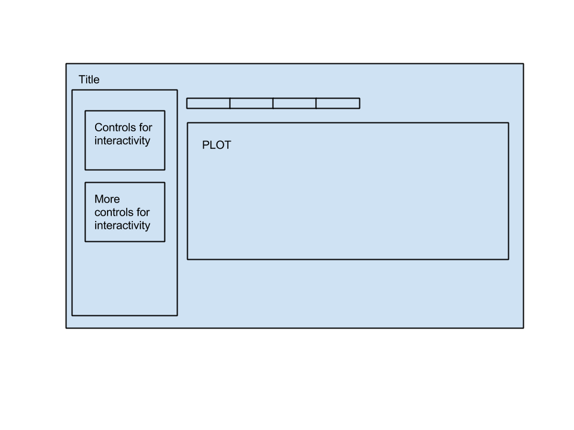

Project: Sketch
==============================

| **Name**  | Prateek Singhal  |
|----------:|:-------------|
| **Email** | psinghal@dons.usfca.edu |

## Discussion ##

To visualize a data set as part of the final project, I have chosen the wine data set. This data set nicely lays out some properties of various kinds of white and red wines. Being a wine lover, I would love to visualize the similarities and differences between various wine types.

## Planned Tools ##

I plan to use `R`, `ggplot2`, `shiny`, `GGally`. `ggplot2` and `GGally` will be used to visualize the basic plots and `Shiny` will be used to create interactivity between and across the plots. 

## Planned Techniques ##

Bubble Plot:
I plan to display the alcohol content in different kinds of wines. It will be interesting to look at the alcohol contents of red wine v/s white wine which will be displayed as bubbles on the plot, the size of the bubble representing the alcohol content. The same can be applied to other continuous variables available in the data set. 

Parallel Co-ordinates plot:
I plan to plot most of the standardized continuous variables on this plot. There are different wine qualities even within white and red wine which will be interesting to look at. This plot will detail differences amongst various wine types against different variables in question.

Heat Map:
A heat map displaying various variables against other variables will make for a good visualization as well. It will detail the contents of different ingredients constituting the wine like pH, chlorides, sugar etc. 

Scatter Plot Matrix:
I also plan to display various quantities on a scatter plot matrix using `GGally`. One of the better things with this visualization is that I would be able to show the scatter plot along with the distributions of different variables involved.

## Planned Interactions ##

The plan as of now is to display all the aforementioned visualizations as tabs in a `Shiny` app with each tab displaying a separate visualization. I plan to implement filtering and brushing which will be consistent across all the visualizations.

## Planned Interface ##

The app will look roughly like this:

